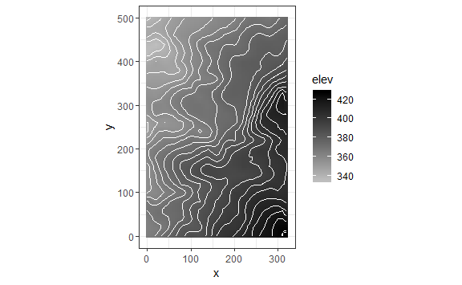

Comparing ggplot2 and fgeo.map
================
Mauro Lepore
2018-10-24

This article compares plots built with **fgeo.map** versus **ggplot2**.

# Elevation

Data

``` r
# https://forestgeo.github.io/fgeo.map/
library(fgeo.map)

elevation <- fgeo.data::luquillo_elevation
str(elevation)
#> List of 4
#>  $ col :Classes 'tbl_df', 'tbl' and 'data.frame':    6565 obs. of  3 variables:
#>   ..$ x   : int [1:6565] 0 0 0 0 0 0 0 0 0 0 ...
#>   ..$ y   : int [1:6565] 0 5 10 15 20 25 30 35 40 45 ...
#>   ..$ elev: num [1:6565] 364 364 363 363 363 ...
#>  $ mat : num [1:101, 1:65] 364 364 363 363 363 ...
#>  $ xdim: int 320
#>  $ ydim: int 500
# Pull elevation dataframe
elev <- elevation$col
```

Quick maps with
**fgeo.map**.

``` r
plot_elevation(elev)
```


    # plot_elevation() also understands the elevation list, so this code outputs the same
    plot_elevation(elevation)

``` r
# You have a number of options you can tweak
plot_elevation(elev,
  # Or choose colors by code from http://bit.ly/2rJgQba
  low = "grey", high = "black", 
  # How many lines, and how thick
  bins = 20, contour_size = 0.5,
  # Hide elevation numbers from inside the plot
  add_elevation_labels = FALSE, 
  # Keep the "level" legend
  hide_color_legend = FALSE
)
```


More flexible maps with **ggplot2**.

``` r
# http://ggplot2.tidyverse.org/reference/
library(ggplot2)

ggplot(elev, aes(x = x, y = y, z = elev)) +
  geom_raster(aes(fill = elev)) +
  geom_contour(color = "white", bins = 20) +
  scale_fill_gradient(low = "grey", high = "black") +
  coord_equal() +
  theme_bw()
```


