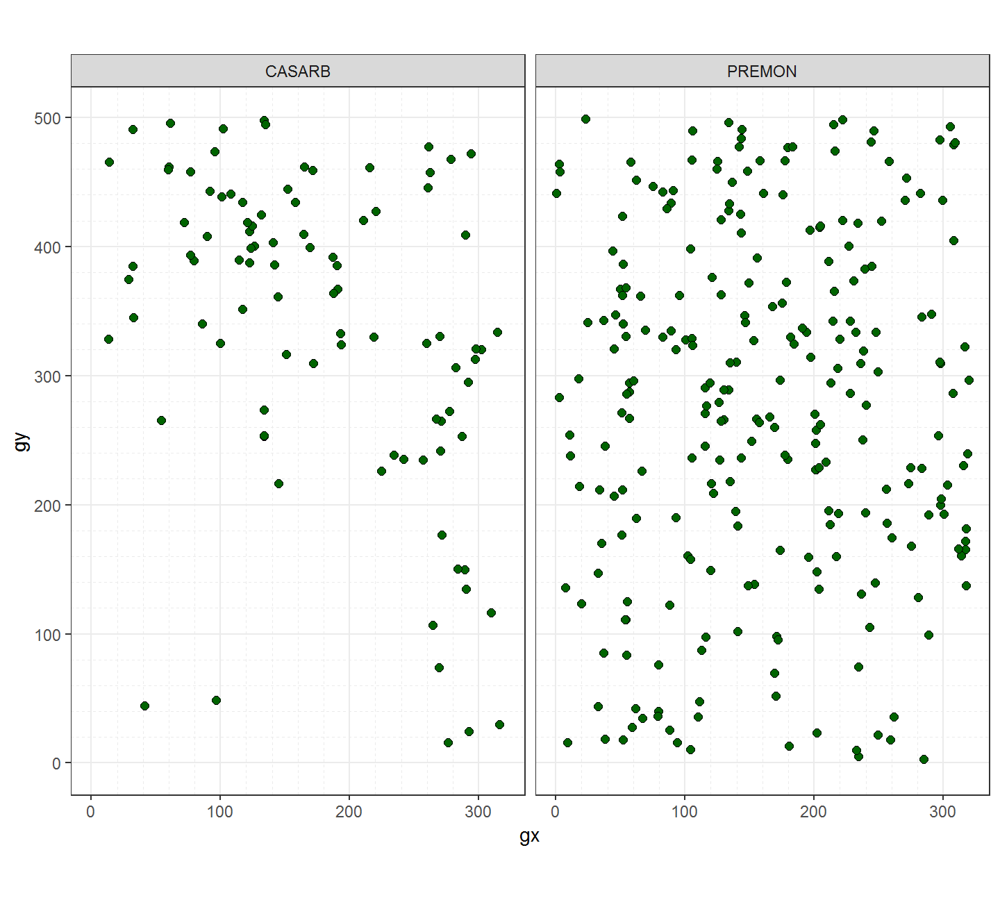
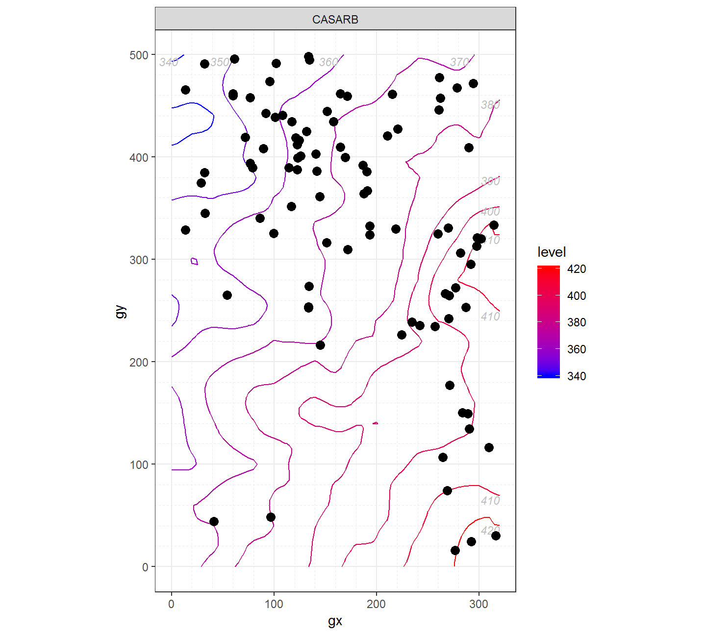
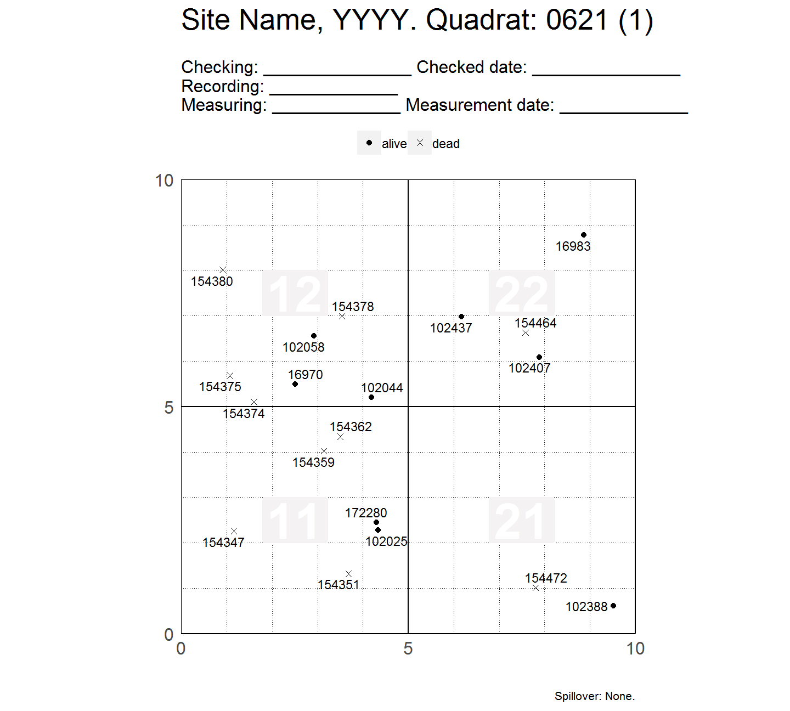
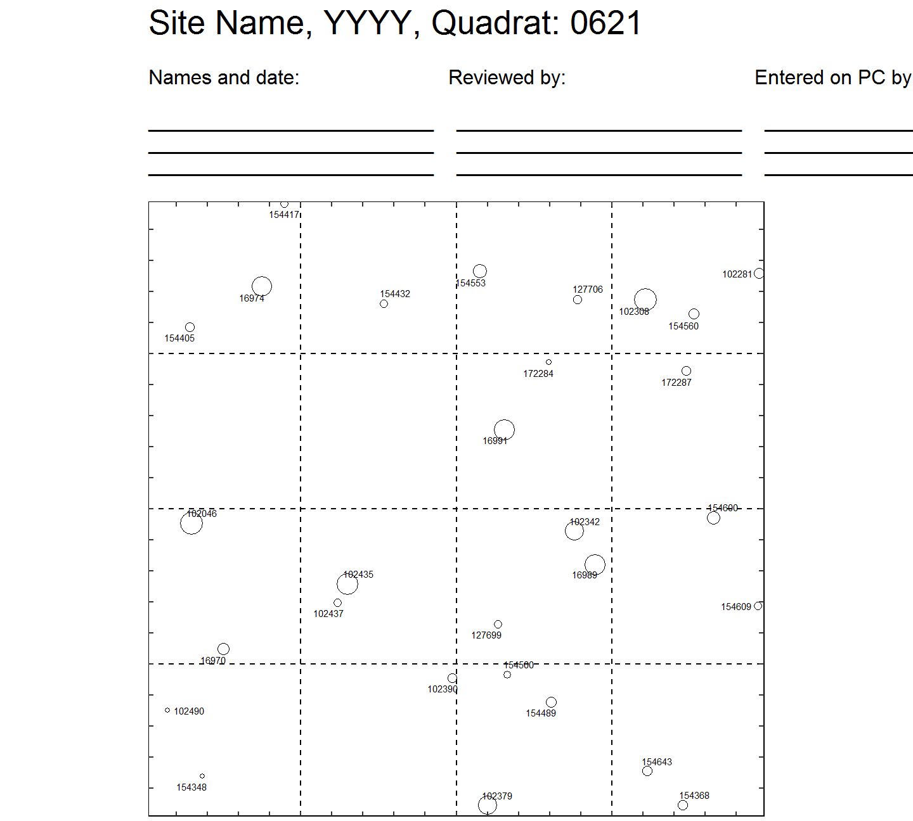

<!-- Don't edit README.md; instead, edit README.Rmd -->

#  Plot ForestGEO-like datasets

[](https://www.tidyverse.org/lifecycle/#experimental)
[](https://travis-ci.org/forestgeo/fgeo.map)
[](https://codecov.io/github/forestgeo/fgeo.map?branch=master)
[](https://cran.r-project.org/package=fgeo.map)

## Installation

Install the pre-release version of **fgeo.map**:

    # install.packages("devtools")
    devtools::install_github("forestgeo/fgeo.map@pre-release")

Or install the development version of **fgeo.map**:

    # install.packages("devtools")
    devtools::install_github("forestgeo/fgeo.map")

Or [install all **fgeo** packages in one
step](https://forestgeo.github.io/fgeo/index.html#installation).

For details on how to install packages from GitHub, see [this
article](https://goo.gl/dQKEeg).

## Example

``` r
library(fgeo.map)

# Small dataset with a few species for quick examples
tree <- subset(fgeo.data::luquillo_tree5_random, sp %in% c("PREMON", "CASARB"))
elevation_list <- fgeo.data::luquillo_elevation
```

``` r
autoplot(sp(tree))
```


``` r
autoplot(sp(tree), point_size = 2, shape = 21, fill = "darkgreen")
```



``` r
# Same
# autoplot(elev(elevation_list$col))
autoplot(elev(elevation_list))
```



``` r
autoplot(sp_elev(tree, elevation_list))
```



``` r
# Customize
autoplot(sp_elev(tree, elevation_list), fill = "red", hide_color_legend = TRUE)
```



[Get started with
**fgeo**](https://forestgeo.github.io/fgeo/articles/fgeo.html)

## Information

  - [Getting help](SUPPORT.md).
  - [Contributing](CONTRIBUTING.md).
  - [Contributor Code of Conduct](CODE_OF_CONDUCT.md).

## Acknowledgments

For ideas and guidance, thanks to Suzanne Lao, Stuart Davis, Shameema
Jafferjee Esufali, David Kenfack and Anudeep Singh.
