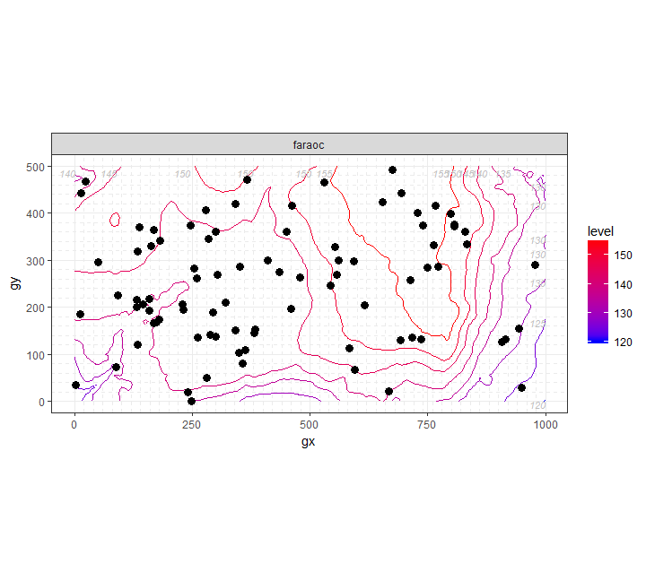
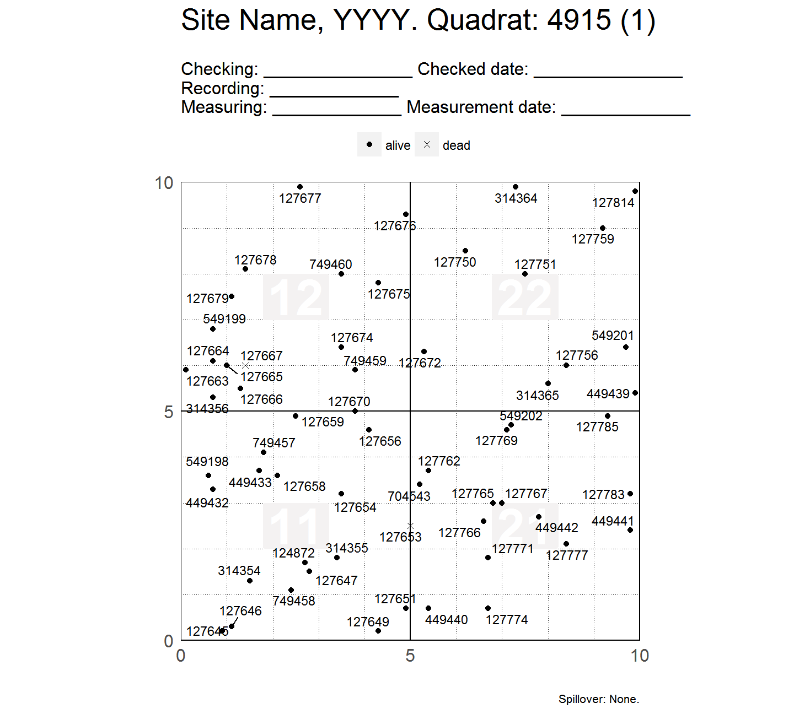
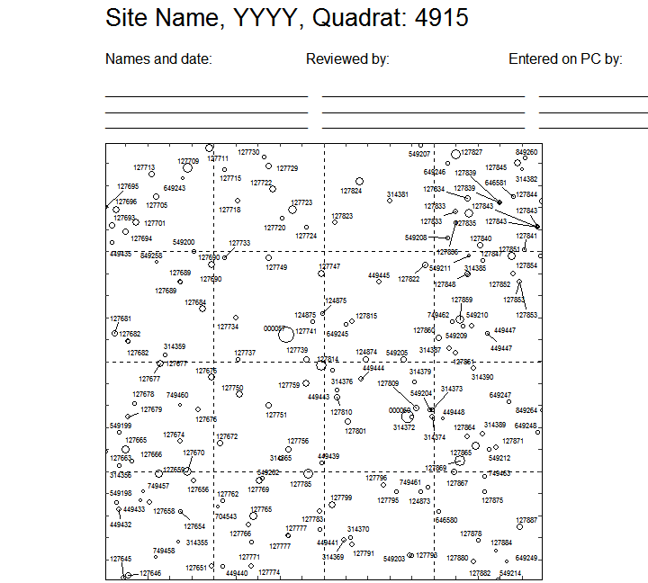

<!-- Don't edit README.md; instead, edit README.Rmd -->

#  Map species, trees and topography.

[](https://www.tidyverse.org/lifecycle/#experimental)
[](https://travis-ci.org/forestgeo/fgeo.map)
[](https://codecov.io/github/forestgeo/fgeo.map?branch=master)
[](https://cran.r-project.org/package=fgeo.map)

## Installation

    # install.packages("remotes")
    remotes::install_github("EDIT-OWNER/EDIT-PACKAGE-NAME")

For details on how to install packages from GitHub, see [this
article](https://goo.gl/dQKEeg).

## Example

``` r
library(fgeo.map)
library(bciex)
library(fgeo.tool)
library(dplyr)
#> 
#> Attaching package: 'dplyr'
#> The following objects are masked from 'package:stats':
#> 
#>     filter, lag
#> The following objects are masked from 'package:base':
#> 
#>     intersect, setdiff, setequal, union
```

Map species’ distribution.

``` r
census <- bci12t7mini
# Fix structure of elevation data
elevation <- fgeo_elevation(bci_elevation)

# All maps
p <- maply_sp_elev(census, elevation, species = c("faraoc", "hybapr"))

# Show first map
first(p)
```



Map tree tags by status, showing four subquadrats per plot-page.

``` r
# Fix two wrong names
viewfulltable <- rename(bci12vft_mini, qx = x, qy = y)

# Filter one plot and one census
vft <- filter(viewfulltable, PlotID == 1, CensusID == 6)

# All maps
p2 <- maply_tag(vft)
length(p2)
#> [1] 40

# Show first map
first(p2)
```



Map trees within a quadrat mapping tree diameter to point size.

``` r
# Filtering:
# * Trees of diameter greater than 10 cm;
# * Last census;
# * Plot 1.
vft2 <- filter(
  viewfulltable,
  DBH > 10,
  CensusID == max(CensusID, na.rm = TRUE),
  PlotID == 1
)

# All maps
p3 <- maply_quad(vft2)
#> * Appending tags of dead trees with the suffix '.d'
#> Warning in fgeo.base::str_suffix_match(crucial$tag, crucial$status,
#> status_d, : No `string` matches `dead`. Is this what you expect?
#> * Standarizing `dbh` by the count of `dbh` measurements
length(p3)
#> [1] 10

# Show first map
first(p3)
```



## Information

  - [Getting help](SUPPORT.md).
  - [Contributing](CONTRIBUTING.md).
  - [Contributor Code of Conduct](CODE_OF_CONDUCT.md).

## Acknowledgments

For ideas and guidance, thanks to Suzanne Lao, Stuart Davis, Shameema
Jafferjee Esufa, David Kenfack and Anudeep Singh.
