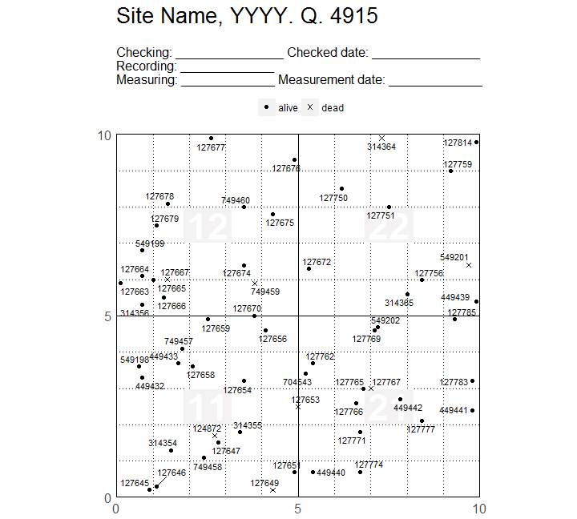

<!-- Don't edit README.md; instead, edit README.Rmd -->
map: map ForestGEO's data 
===============================================================================================

[](https://travis-ci.org/forestgeo/map) [](https://codecov.io/github/forestgeo/map?branch=master) [](https://cran.r-project.org/package=map)

Installation
------------

Install **map** from GitHub with:

``` r
# To install from a private repo, see auth_token at https://goo.gl/re1LFe
# install.packages("remotes")
remotes::install_github(repo = "forestgeo/map")
library(map)
```

Or with:

``` r
source("https://install-github.me/forestgeo/map")
```

Example
-------

``` r
library(dplyr)
library(map)

# Filter the plot you want to map
vft <- dplyr::filter(map::bci12vft_mini, PlotID == 1)

# This data set has two wrong names that need to be fixed before using map_tag()
vft_rnm <- dplyr::rename(vft, qx = x, qy = y)
maps <- map_tag(vft_rnm)
#> Warning in map_tag(vft_rnm): Multiple censuses were detected
#>   * Filtering only the greatest `CensusID`

# Plotting only one map to screen
maps[1]
#> $`4915_1`
```


