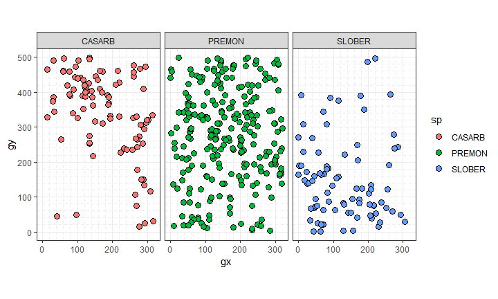
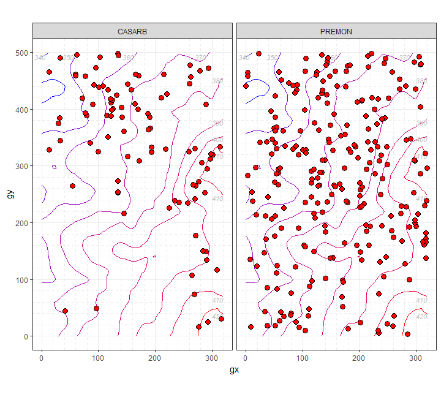

<!-- Don't edit README.md; instead, edit README.Rmd -->

#  Plot ForestGEO data

[](https://www.tidyverse.org/lifecycle/#experimental)
[](https://travis-ci.org/forestgeo/fgeo.plot)
[](https://codecov.io/github/forestgeo/fgeo.plot?branch=master)
[](https://cran.r-project.org/package=fgeo.plot)

## Installation

Install the development version of **fgeo.plot**:

    # install.packages("devtools")
    devtools::install_github("forestgeo/fgeo.plot")

Or [install all **fgeo** packages in one
step](https://forestgeo.github.io/fgeo/index.html#installation).

For details on how to install packages from GitHub, see [this
article](https://goo.gl/dQKEeg).

## Example

``` r
library(fgeo.plot)

small_census <- fgeo.x::tree6_3species
autoplot(sp(small_census))
```



``` r
elevation <- fgeo.x::elevation
autoplot(
  sp_elev(small_census, elevation),
  fill = "red", 
  hide_color_legend = TRUE
)
```



[Get started with
**fgeo**](https://forestgeo.github.io/fgeo/articles/fgeo.html)

## Information

  - [Getting help](SUPPORT.md).
  - [Contributing](CONTRIBUTING.md).
  - [Contributor Code of Conduct](CODE_OF_CONDUCT.md).
