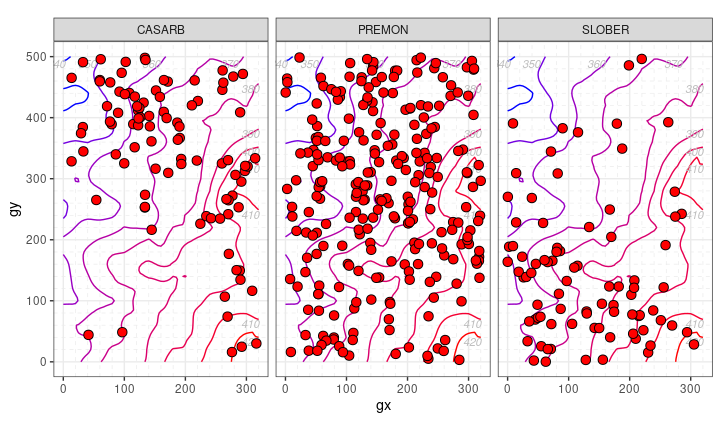

<!-- Don't edit README.md; instead, edit README.Rmd -->

#  Plot ForestGEO data

<!-- badges: start -->

<!-- badges: end -->

**fgeo.plot** helps you to plot
[ForestGEO](http://www.forestgeo.si.edu/) data.

## Installation

Install the latest stable version of **fgeo.plot** from CRAN with:

``` r
install.packages("fgeo.plot", repos = these_repos)
```

Or install the development version of **fgeo.plot** with:

``` r
# install.packages("devtools")
devtools::install_github("forestgeo/fgeo.plot")
```

Or [install all **fgeo** packages in one
step](https://forestgeo.github.io/fgeo/index.html#installation).

## Example

``` r
library(fgeo.plot)
#> Registered S3 methods overwritten by 'ggplot2':
#>   method         from 
#>   [.quosures     rlang
#>   c.quosures     rlang
#>   print.quosures rlang

small_census <- fgeo.x::tree6_3species

autoplot(sp(small_census))
```


``` r
elevation <- fgeo.x::elevation

autoplot(
  sp_elev(small_census, elevation),
  fill = "red", 
  hide_color_legend = TRUE
)
```



[Get started with **fgeo**](https://forestgeo.github.io/fgeo)

## Information

  - [Getting help](https://forestgeo.github.io/fgeo.plot/SUPPORT.html).
  - [Contributing](https://forestgeo.github.io/fgeo.plot/CONTRIBUTING.html).
  - [Contributor Code of
    Conduct](https://forestgeo.github.io/fgeo.plot/CODE_OF_CONDUCT.html).
